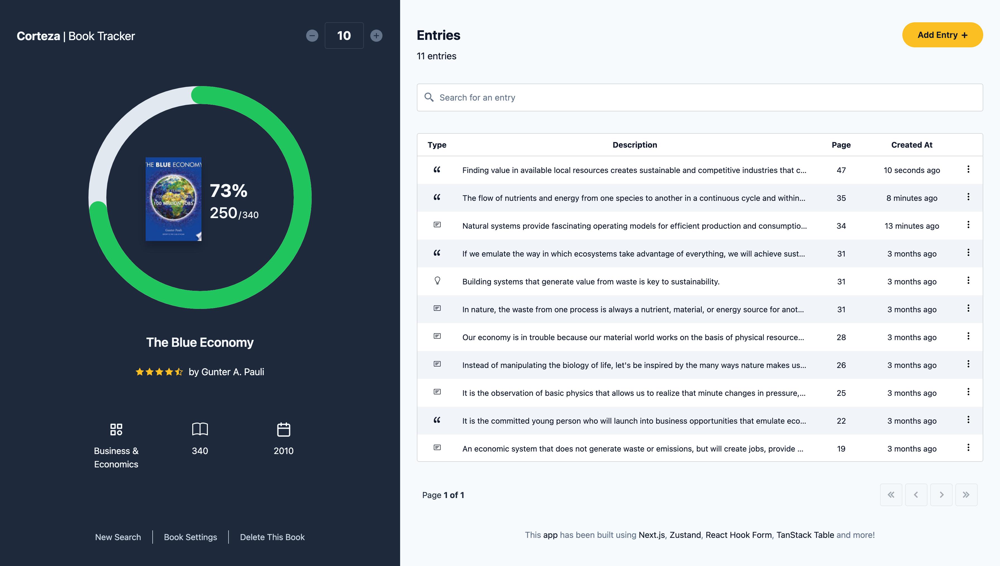

# Corteza

Track your reading progress and keep all your book notes organized in one place.

## Table of Contents

- [Motivation](#motivation)
- [Solution](#solution)
- [Features](#features)
- [How does it work?](#how-does-it-work)
- [Demo](#demo)
- [Technologies](#technologies)
- [Lessons learned](#lessons-learned)
- [Feedback](#feedback)

## Motivation

When I started reading more often I quickly realized that I needed a way to keep the important information I read (or the ideas I came up with) stored in one place, because I am not a person who likes to underline his books with a pen, and even if I were, then I would have a hard time finding a specific line(s) I wanted to review out of all the underlined lines. Also, I often forget which was the last page I read and find myself having some trouble resuming my reading, I know there are some tools for this like bookmarks but I'm not into them.

## Solution

Corteza is an application that helps you keep track of the books you read, save notes, ideas you may have while reading, your favorite quotes from the author or any other relevant information related to the book you are reading, all linked to the specific book you have selected to track. This information is saved in your computer's local storage and displayed through a table, you can easily find any of these entries using a dedicated search bar. You can also add the number of pages you read per session to keep track of the progress you have made so far and to inspire you to finish your books.

## Features

- Search books from the Google API.
- Add/Delete books from your tracking list.
- Book settings, edit technical details of your book.
- Add entries to your books.
- Sort entries by column (entry type, page number, etc).
- Easily find an entry using the entry search bar.
- Track the numbers of pages you've read.

## How does it work?

1. First you need to search for the book you want to track.
2. Once found, select the book and click on "start tracking".
3. If some data is missing in the book retrieved from the API, the application will prompt you to fill in the missing fields for better tracking.
4. Once all the necessary data is available, you'll be redirected to the book tracking page.
5. Start adding entries, these can be any kind of information you find relevant to your book: notes, ideas, quotes, etc.
6. At the end of your reading session add the number of pages you have read and you'll see your progress reflected in a circular graph along with the percentage of the book you have completed.

## Demo

Here is the link to the working app: https://corteza-book-tracker.vercel.app/

## Technologies

- [Next.js](https://nextjs.org) - A React framework that gives you building blocks to create web applications.
- [React Hook Form](https://react-hook-form.com) - Performant, flexible and extensible forms with easy-to-use validation.
- [TanStack Table](https://tanstack.com/table/v8) - Headless UI for building powerful tables & datagrids.
- [Zustand](https://github.com/pmndrs/zustand) - A small, fast and scalable state-management solution.
- [SCSS](https://sass-lang.com/) - Pre-processor that extends some of the features of the CSS language.

## Lessons Learned

- I learned that working with css in react the traditional way (creating and importing files for each module, making up class names for everything, etc.) can be time consuming, exhausting and ultimately expensive. I realized I needed a better way to do this, so I started exploring solutions like tailwindcss for my next project.
- I noticed that the amount of files in my project started to grow considerably and my source directory felt bloated and messy, that's when I told myself it was time to learn best practices on maintenance, scalability and clean architecture.
- Using conventional commits helped me better understand how to group my code and be more organized with the work I do.

## Feedback

If you wish to provide any feedback or just to have a little chat you can contact me through the following email: joangavelan@gmail.com.
